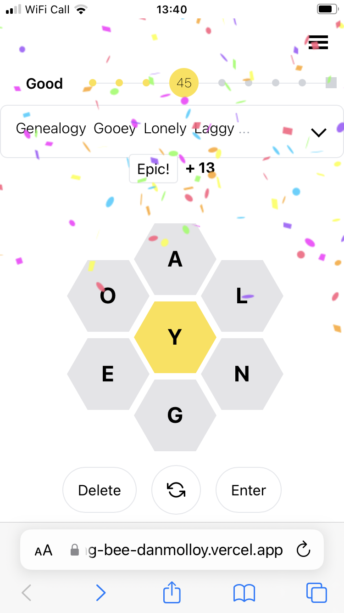
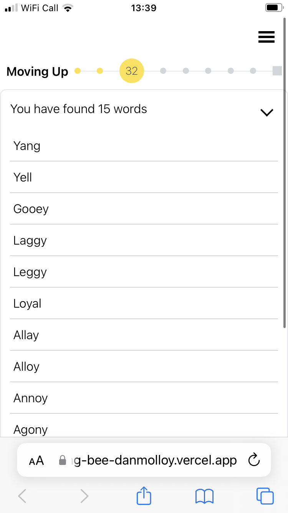
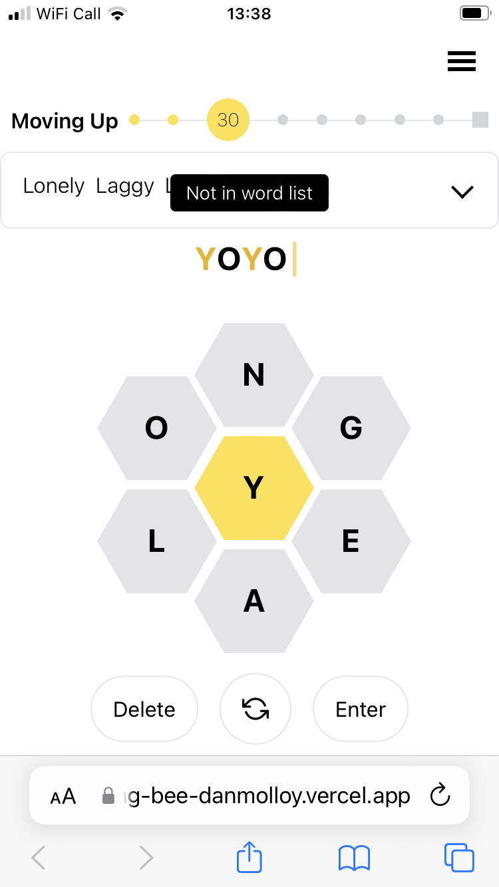

# Spelling Bee

## Overview
I am a big fan of word games, in particular NYT's [Spelling Bee](https://www.nytimes.com/puzzles/spelling-bee). I enjoy playing it so much I created a replica. 

## Game Rules
Very simply, each day a list of seven letters generate. The goal is to find as many words as you can which are at least four letters. There is one center letter which must be used in all words. Additionally, there is always at least one "pangram", a word which uses all letters at least once. 

## Features
### Design
I've done my very best to replicate the design of the game and respected the playful UX. I've added [react-canvas-confetti](https://www.npmjs.com/package/react-canvas-confetti) when a pangram is found.

### Fetches the letters
It uses the actual NYT letters - the app fetches the NYT source code (I've chosen to use yesterday's data - can't imagine NYT would be happy with today's game out there for free). 

### Local storage
As I enjoy playing throughout the day, it saves your answers in local storage so you can enjoy the game throughout the day. This resets when NYT updates the data.

## Stack
- Next JS
- TypeScript
- Tailwind
- Jest

## Credit
Many thanks to James Tauber for [CSS Hexagon Tutorial](https://jtauber.github.io/articles/css-hexagon.html), Visnu Pitiyanuvath for his [Observable Spelling Bee](https://observablehq.com/@visnup/spelling-bee), and of course NYT and Sam Ezersky for such a fantastic game.